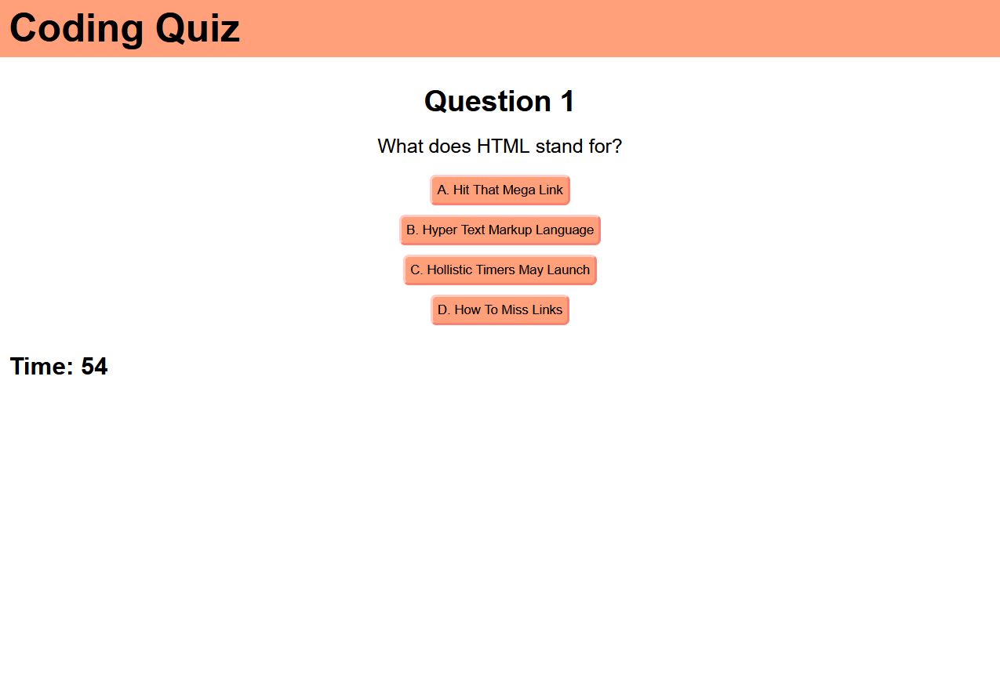

# Coding Quiz

## Description

This site serves as a means of reviewing study material in the form of multiple choice questions. The site is coded in such a way where questions can be added or removed without breaking the functionality of the site. This means that as more material is learned, or needs to be reviewed, more questions can be added. Additional functionality can also potentially be added later. 

Through development of this site, I learned of some of the versatility and power of arrays, including two-dimensional arrays, and the merits of programming broad frameworks to make them able to handle changes in content more easily.

## Screenshot

## Link
https://joshmusto.github.io/04-code-quiz/
